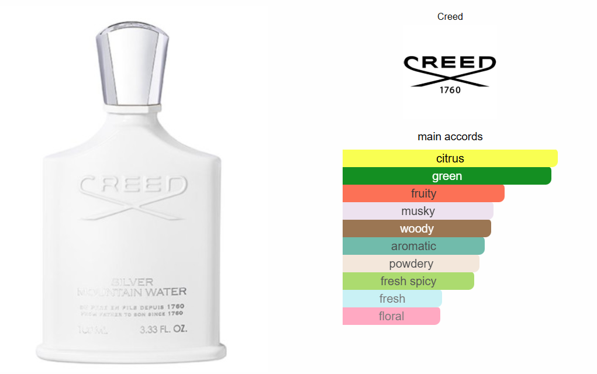
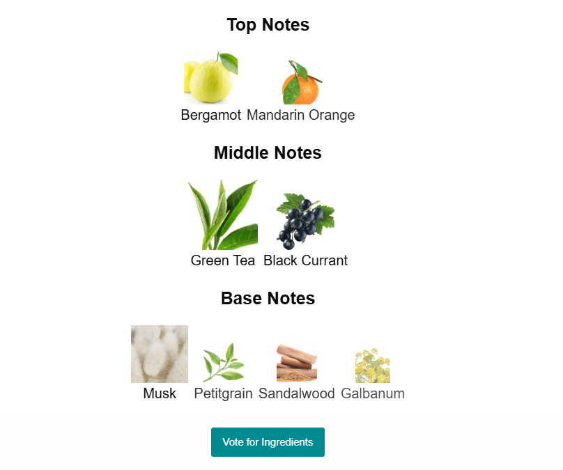

# Frontend - E-commerce de Perfumes

Aplicación frontend del proyecto de comercio electrónico de perfumes, desarrollada con React, TypeScript y Vite, que ofrece una experiencia de usuario moderna y responsive.

## 🚀 Tecnologías Utilizadas

### Core

- **React 18** - Biblioteca de JavaScript para construir interfaces de usuario
- **TypeScript** - Superset de JavaScript con tipado estático
- **Vite** - Herramienta de desarrollo rápida y bundler

### UI/UX

- **Material-UI (MUI)** - Componentes de interfaz de usuario
- **Bootstrap 5** - Framework CSS para diseño responsive
- **Bootstrap Icons** - Iconografía
- **Lucide React** - Iconos adicionales
- **React Icons** - Biblioteca de iconos

### Navegación y Estado

- **React Router Dom** - Enrutamiento del lado del cliente
- **React Context API** - Manejo de estado global (carrito de compras)

### Herramientas de Desarrollo

- **ESLint** - Linter para identificar problemas en el código
- **TypeScript ESLint** - Reglas específicas para TypeScript

## 📁 Estructura del Proyecto

```
src/
├── components/         # Componentes reutilizables
│   ├── Header/        # Cabecera con navegación y búsqueda
│   ├── Footer/        # Pie de página
│   ├── ProductCard/   # Tarjeta de producto
│   ├── ProductList/   # Lista de productos
│   ├── PerfumeDetail/ # Detalle del perfume
│   ├── LoginForm/     # Formulario de inicio de sesión
│   ├── SignInForm/    # Formulario de registro
│   ├── PaymentForm/   # Formulario de pago
│   ├── Profile/       # Perfil de usuario
│   ├── Carousel/      # Carrusel de imágenes
│   └── ...           # Otros componentes
├── pages/             # Páginas principales
│   ├── HomePage/      # Página de inicio
│   ├── LoginPage/     # Página de login
│   ├── SignInPage/    # Página de registro
│   ├── ProfilePage/   # Página de perfil
│   ├── CarritoPage/   # Página del carrito
│   ├── PaymentFormPage/ # Página de pago
│   └── ...           # Páginas por categoría
├── Context/           # Contextos de React
│   └── Carrito/       # Contexto del carrito de compras
├── data/              # Datos estáticos
│   ├── arabes.json    # Perfumes árabes
│   ├── diseñador.json # Perfumes de diseñador
│   ├── nicho.json     # Perfumes de nicho
│   └── ...           # Otros catálogos
├── utils/             # Utilidades y helpers
│   ├── perfumeLoader.ts  # Cargador de perfumes
│   ├── productLoader.ts  # Cargador de productos
│   └── tokenUtils.ts     # Utilidades de tokens
├── global/            # Configuraciones globales
│   └── Routes/        # Configuración de rutas
└── App.tsx           # Componente principal
```

## 🛠️ Instalación y Configuración

### Prerrequisitos

- Node.js (v18 o superior)
- npm o yarn

### Instalación

1. **Navega al directorio del frontend:**

   ```bash
   cd frontend
   ```

2. **Instala las dependencias:**

   ```bash
   npm install
   ```

3. **Instala React Router Dom (si es necesario):**
   ```bash
   npm install react-router-dom
   ```

## 🚀 Ejecución

### Modo Desarrollo

```bash
npm run dev
```

La aplicación se ejecutará en `http://localhost:5173` por defecto.

### Construcción para Producción

```bash
npm run build
```

### Vista Previa de Producción

```bash
npm run preview
```

### Linting

```bash
npm run lint
```

## 🌟 Características Principales

### 🏠 Página de Inicio

- Carrusel de productos destacados
- Navegación por categorías
- Productos más populares

### 🛍️ Catálogo de Productos

- **Categorías disponibles:**
  - Perfumes de Nicho
  - Perfumes de Diseñador
  - Perfumes Árabes
  - Nuevos Lanzamientos
  - Testers
  - Decants

### 🔍 Funcionalidades de Búsqueda

- Búsqueda por nombre
- Filtrado por categoría
- Búsqueda en tiempo real

### 👤 Gestión de Usuarios

- Registro de nuevos usuarios
- Inicio de sesión
- Perfil de usuario
- Recuperación de contraseña

### 🛒 Carrito de Compras

- Agregar productos al carrito
- Modificar cantidades
- Eliminar productos
- Persistencia del carrito
- Cálculo automático de totales

### 💳 Proceso de Pago

- Formulario de información personal
- Validación de datos de tarjeta
- Confirmación de pedido

### 📱 Diseño Responsive

- Optimizado para móviles
- Adaptable a tablets
- Diseño desktop moderno

## 🎨 Componentes Principales

### Header

- Navegación principal
- Barra de búsqueda
- Iconos de carrito y perfil
- Menú responsive

### ProductCard

- Imagen del producto
- Información básica
- Precio
- Botón de agregar al carrito

### PerfumeDetail

- Imágenes del producto
- Descripción completa
- Información de acordes
- Pirámide olfativa

### Carousel

- Slider de imágenes
- Navegación automática
- Indicadores de posición

## 🎯 Futuras Mejoras

### Vista Detallada de Productos

- [ ] Implementar zoom en imágenes
- [ ] Galería de imágenes múltiples
- [ ] Información detallada de acordes principales
- [ ] Pirámide olfativa interactiva

### Ejemplos de Mejoras Visuales:

**Acordes Principales:**


**Pirámide Olfativa:**


### Perfil de Usuario

- [ ] Diseño mejorado del perfil
- [ ] Historial de compras detallado
- [ ] Perfil editable
- [ ] Preferencias de usuario

### Funcionalidades Adicionales

- [ ] Sistema de favoritos
- [ ] Comparador de productos
- [ ] Reseñas y valoraciones
- [ ] Notificaciones push
- [ ] Modo oscuro/claro

## 🔧 Configuración Avanzada

### Variables de Entorno

Crear un archivo `.env` en la raíz del frontend:

```env
VITE_API_URL=http://localhost:3000/api
VITE_APP_NAME=Perfume Store
```

### Configuración de Vite

El archivo `vite.config.ts` incluye:

- Plugin de React
- Configuración de alias
- Optimización de build

## 📦 Scripts Disponibles

```json
{
  "dev": "vite", // Servidor de desarrollo
  "build": "tsc && vite build", // Construcción para producción
  "lint": "eslint . --ext ts,tsx", // Linting del código
  "preview": "vite preview" // Vista previa de producción
}
```

## 🐛 Solución de Problemas

### Problemas Comunes

1. **Error de módulos no encontrados:**

   ```bash
   rm -rf node_modules package-lock.json
   npm install
   ```

2. **Errores de TypeScript:**

   ```bash
   npm run build
   ```

3. **Problemas de puerto:**
   ```bash
   npm run dev -- --port 3001
   ```

## 👥 Integrantes del Equipo

- **Kenneth Osorio Masis** - C15724
- **Antony Picado Alvarado** - C15939
- **Esteban Chacón Chaves** - C22039
- **Ignacio Alesina Acuña** - C5A073
